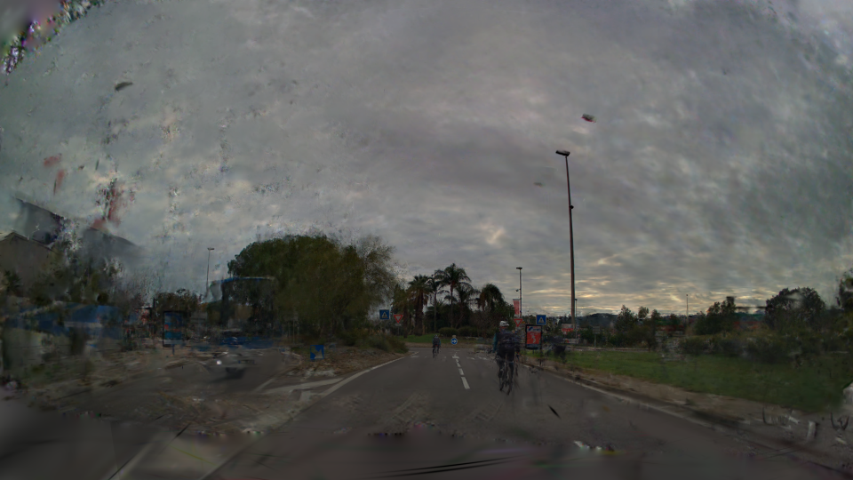

# Fixer training dataset preparation tutorial

There are four different methods to generate image pair for training the Fixer model:

- Sparse reconstruction
- Cycle reconstruction
- Model underfitting
- Cross reference

In this tutorial, we will walk through the steps for sprase reconstruction, model underfitting and cross reference based on NuRec.

## Sparse reconstruction

Train a 3D representation with every nth frame and pair the remaining ground truth images with the rendered “novel” views.

### Visualization
|Ground truth|Reconstruction|
|---|---|
|||

## Model underfitting
Underfit a reconstruction by training it with a reduced number of iterations (25%-75% of the original training schedule).

### Visualization
|Ground truth|Reconstruction|
|---|---|
|||

## Cross reference
Train the reconstruction model solely with one camera and render images from the remaining held out cameras.

### Visualization
|Ground truth|Reconstruction|
|---|---|
|||